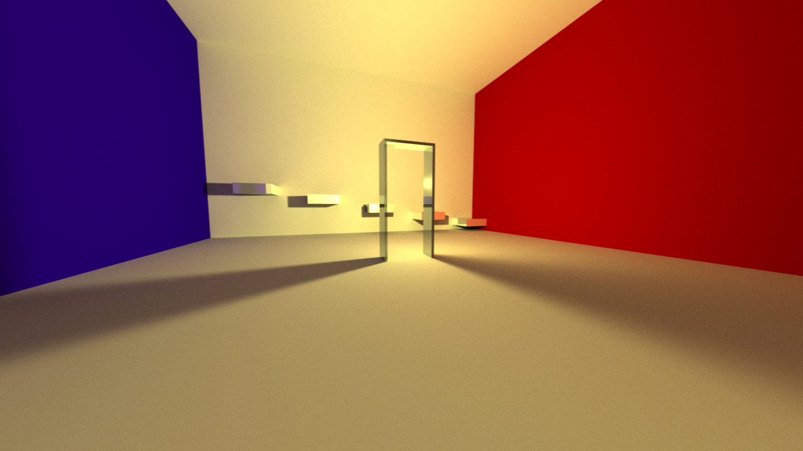

# Project LINK
Project-Link is a WebGL 3D engine in the making. This engine will support scene creation and editing along with options for multiple rendering methods.

---

## Current Path tracing Abilities

---

## Current physics support for particle systems

---

